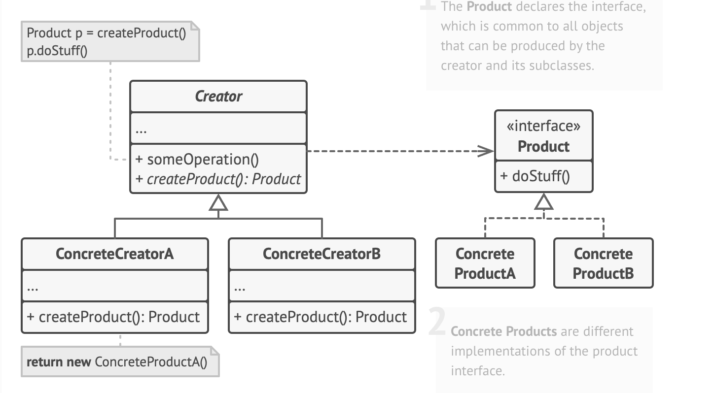
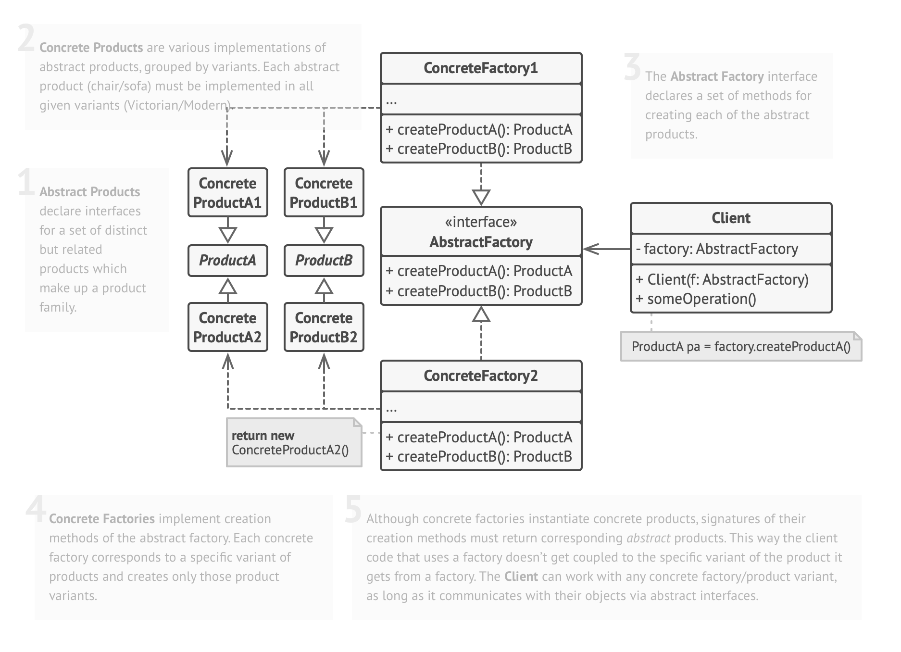
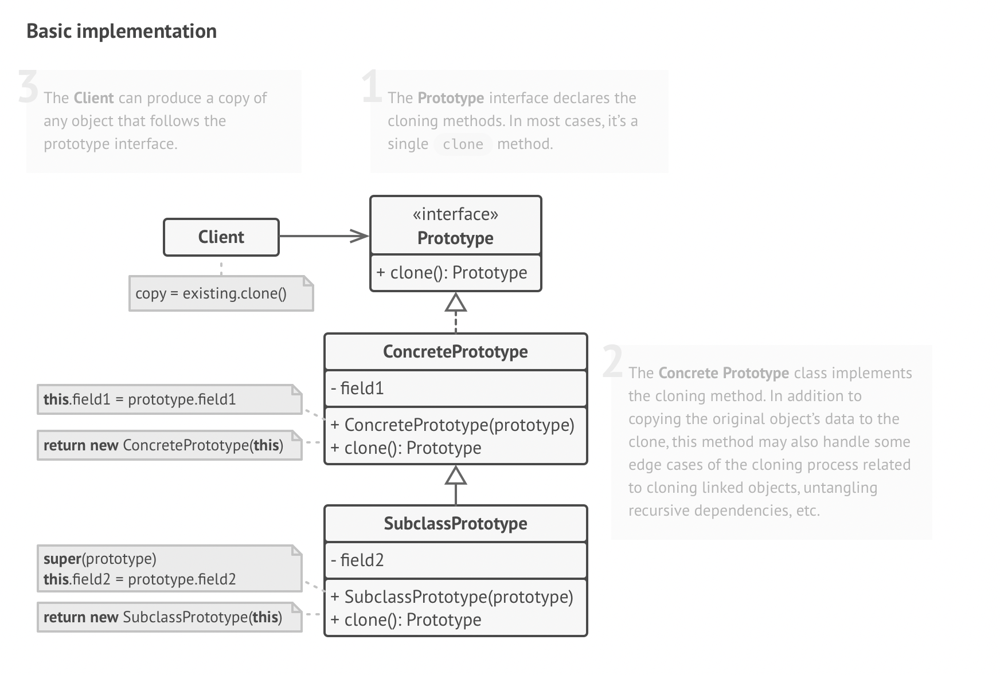
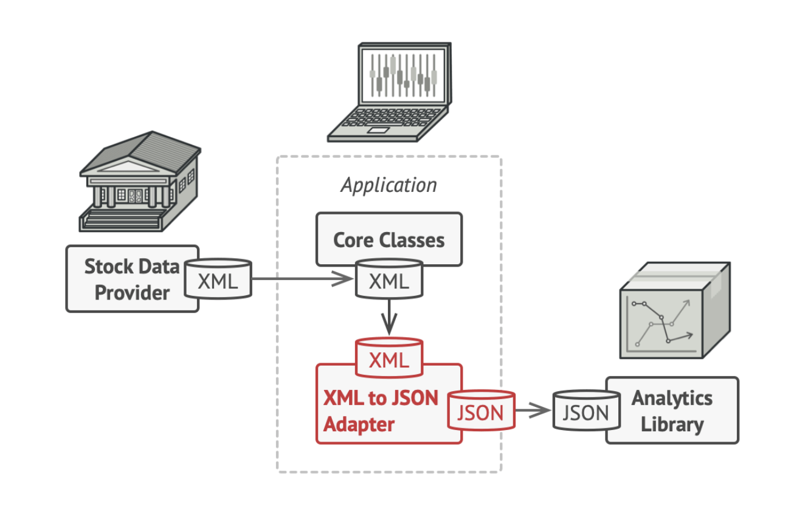
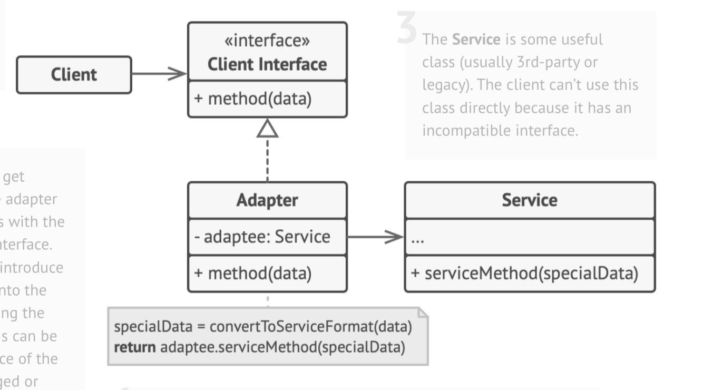
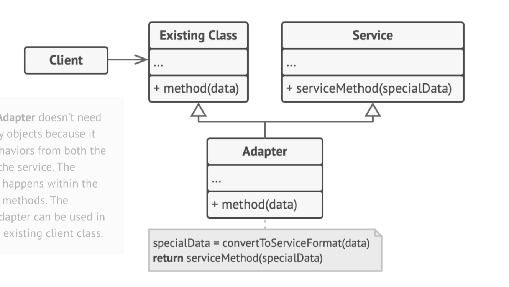
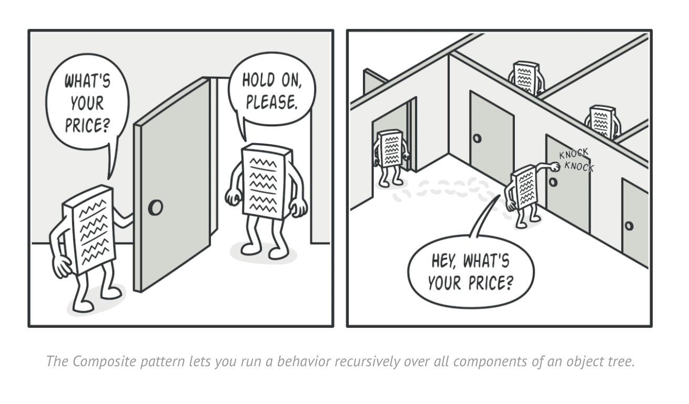
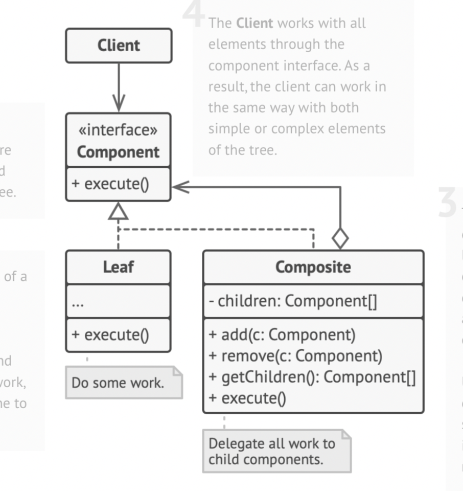
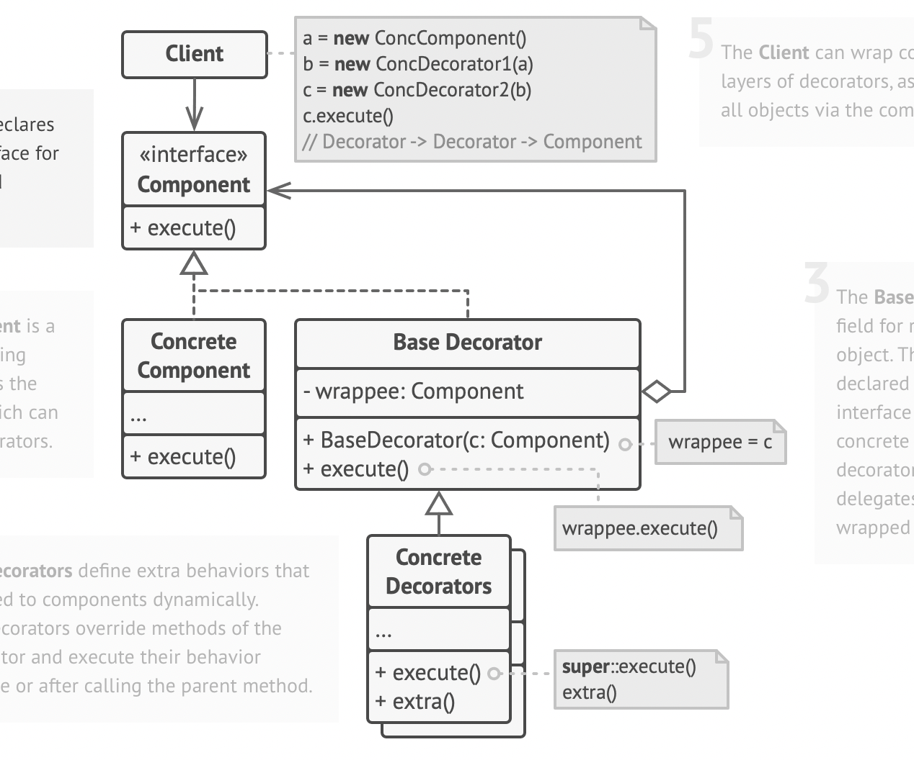

#  Design Patterns
  
  
- [Design Patterns](#design-patterns )
  - [Factory Method](#factory-method )
    - [主要思想](#主要思想 )
    - [引例](#引例 )
    - [要素](#要素 )
    - [优缺点](#优缺点 )
    - [使用场景](#使用场景 )
    - [代码](#代码 )
  - [Abstract Factory](#abstract-factory )
    - [主要思想](#主要思想-1 )
    - [引例](#引例-1 )
    - [要素](#要素-1 )
    - [优缺点](#优缺点-1 )
    - [适用场景](#适用场景 )
    - [代码](#代码-1 )
  - [Builder](#builder )
    - [主要思想](#主要思想-2 )
    - [引例](#引例-2 )
    - [要素](#要素-2 )
    - [优缺点](#优缺点-2 )
    - [适用场景](#适用场景-1 )
    - [代码](#代码-2 )
  - [Prototype](#prototype )
    - [主要思想](#主要思想-3 )
    - [引例](#引例-3 )
    - [要素](#要素-3 )
    - [优缺点](#优缺点-3 )
    - [适用场景](#适用场景-2 )
    - [代码](#代码-3 )
  - [Singleton](#singleton )
    - [主要思想](#主要思想-4 )
    - [引例](#引例-4 )
    - [要素](#要素-4 )
    - [优缺点](#优缺点-4 )
    - [适用场景](#适用场景-3 )
    - [code](#code )
  - [Adapter](#adapter )
    - [主要思想](#主要思想-5 )
    - [引例](#引例-5 )
    - [要素](#要素-5 )
    - [优缺点](#优缺点-5 )
    - [使用场景](#使用场景-1 )
    - [code](#code-1 )
  - [Bridge](#bridge )
    - [主要思想](#主要思想-6 )
    - [引例](#引例-6 )
    - [要素](#要素-6 )
    - [优缺点](#优缺点-6 )
    - [适用场景](#适用场景-4 )
    - [代码](#代码-4 )
  - [Composite](#composite )
    - [主要思想](#主要思想-7 )
    - [引例](#引例-7 )
    - [要素](#要素-7 )
    - [优缺点](#优缺点-7 )
    - [适用场景](#适用场景-5 )
    - [代码](#代码-5 )
  - [Decorator](#decorator )
    - [主要思想](#主要思想-8 )
    - [引例](#引例-8 )
    - [要素](#要素-8 )
    - [优缺点](#优缺点-8 )
    - [适用场景](#适用场景-6 )
    - [code](#code-2 )
  
##  Factory Method
  
###  主要思想
  
- 定义一个创建对象的接口，但让实现这个接口的类来决定实例化哪个类。工厂方法让类的实例化推迟到子类中进行。
###  引例
  
- 有一个物流系统，有海上物流（船），有道路物流（卡车），每个订单都会指定一种物流方式，并使用相应的交通工具进行运输。
- 每次初始化新的交通对象都需要指定特定类。每次新添加交通方式比如航空运输时，需要修改代码
- 引入一个抽象类Factory，它有各种子类实现，每个子类工厂对应着一种具体的交通方式，并都实现了共同的方法(创造交通工具)；同样，这些交通工具都有一个共同的抽象父类，声明了一种共同的方法（运输）。依托Factory和Product的两种抽象，能够实现里氏原则，对修改封闭，对增加开放。
  

  
###  要素
  
- Product：抽象产品，定义工厂方法所创建的对象的接口，也就是实际需要使用的对象的接口
- ConcreteProduct：具体产品，具体的 Product 接口的实现对象
- Factory：工厂接口，也可以叫 Creator(创建器)，声明工厂方法，通常返回一个 Product 类型的实例对象
- ConcreteFactory：工厂实现，或者叫 ConcreteCreator(创建器对象)，覆盖 Factory 定义的工厂方法，返回具体的 Product 实例
  
###  优缺点
  
- 优点
  - 一个调用者想创建一个对象，只要知道其名称就可以了。
  - 扩展性高，如果想增加一个产品，只要扩展一个工厂类就可以。
  - 屏蔽产品的具体实现，调用者只关心产品的接口。
- 缺点
  - 每次增加一个产品时，都需要增加一个具体类和对象实现工厂，使得系统中类的个数成倍增加，在一定程度上增加了系统的复杂度，同时也增加了系统具体类的依赖。
  
###  使用场景
  
- 日志记录器：记录可能记录到本地硬盘、系统事件、远程服务器等，用户可以选择记录日志到什么地方。
- 数据库访问，当用户不知道最后系统采用哪一类数据库，以及数据库可能有变化时。
- 设计一个连接服务器的框架，需要三个协议，"POP3"、"IMAP"、"HTTP"，可以把这三个作为产品类，共同实现一个接口。
  
###  代码
  
```c++
//
//  Factory.h
//  DesignPatterns
//
//  Created by cz-mac on 2021/10/28.
//
  
#ifndef Factory_h
#define Factory_h
/**
 * The Product interface declares the operations that all concrete products must
 * implement.
 */
  
class Product {
 public:
  virtual ~Product() {}
  virtual std::string Operation() const = 0;
};
  
/**
 * Concrete Products provide various implementations of the Product interface.
 */
class ConcreteProduct1 : public Product {
 public:
  std::string Operation() const override {
    return "{Result of the ConcreteProduct1}";
  }
};
  
  
class ConcreteProduct2 : public Product {
 public:
  std::string Operation() const override {
    return "{Result of the ConcreteProduct2}";
  }
};
  
/**
 * The Creator class declares the factory method that is supposed to return an
 * object of a Product class. The Creator's subclasses usually provide the
 * implementation of this method.
 */
  
class Creator {
  /**
   * Note that the Creator may also provide some default implementation of the
   * factory method.
   */
 public:
  virtual ~Creator(){};
  virtual Product* FactoryMethod() const = 0;
  /**
   * Also note that, despite its name, the Creator's primary responsibility is
   * not creating products. Usually, it contains some core business logic that
   * relies on Product objects, returned by the factory method. Subclasses can
   * indirectly change that business logic by overriding the factory method and
   * returning a different type of product from it.
   */
  
  std::string SomeOperation() const {
    // Call the factory method to create a Product object.
    Product* product = this->FactoryMethod();
    // Now, use the product.
    std::string result = "Creator: The same creator's code has just worked with " + product->Operation();
    delete product;
    return result;
  }
};
  
/**
 * Concrete Creators override the factory method in order to change the
 * resulting product's type.
 */
class ConcreteCreator1 : public Creator {
  /**
   * Note that the signature of the method still uses the abstract product type,
   * even though the concrete product is actually returned from the method. This
   * way the Creator can stay independent of concrete product classes.
   */
 public:
  Product* FactoryMethod() const override {
    return new ConcreteProduct1();
  }
};
  
class ConcreteCreator2 : public Creator {
 public:
  Product* FactoryMethod() const override {
    return new ConcreteProduct2();
  }
};
  
/**
 * The client code works with an instance of a concrete creator, albeit through
 * its base interface. As long as the client keeps working with the creator via
 * the base interface, you can pass it any creator's subclass.
 */
void ClientCode(const Creator& creator) {
  // ...
  std::cout << "Client: I'm not aware of the creator's class, but it still works.\n"
            << creator.SomeOperation() << std::endl;
  // ...
}
  
/**
 * The Application picks a creator's type depending on the configuration or
 * environment.
 */
  
void test_factor(){
    std::cout << "App: Launched with the ConcreteCreator1.\n";
     Creator* creator = new ConcreteCreator1();
     ClientCode(*creator);
     std::cout << std::endl;
     std::cout << "App: Launched with the ConcreteCreator2.\n";
     Creator* creator2 = new ConcreteCreator2();
     ClientCode(*creator2);
  
     delete creator;
     delete creator2;
     return;
}
  
#endif /* Factory_h */
  
```
  
##  Abstract Factory
  
###  主要思想
  
  
- 抽象工厂模式是工厂方法模式的升级版本，他用来创建一组相关或者相互依赖的对象。
- 他与工厂方法模式的区别就在于，工厂方法模式针对的是一个产品等级结构；而抽象工厂模式则是针对的多个产品等级结构。在编程中，通常一个产品结构，表现为一个接口或者抽象类，也就是说，工厂方法模式提供的所有产品都是衍生自同一个接口或抽象类，而抽象工厂模式所提供的产品则是衍生自不同的接口或抽象类。
###  引例
  
- 有一个家具厂，生产椅子、沙发、咖啡桌等产品，每种产品都有不同的风格，比如欧式、中式等等。
- 每个工厂指定一个风格，比如欧式工厂，该工厂能够生产各种产品如椅子、沙发、咖啡桌等，这些产品都是欧式风格。
- 每个具体工厂都继承自抽象工厂，每个具体产品都继承自抽象产品
  
###  要素
  
  
- AbstractFactory：抽象工厂，用于声明生成抽象产品的方法
- ConcreteFactory：具体工厂，实现抽象工厂定义的方法，具体实现一系列产品对象的创建
- AbstractProduct：抽象产品，定义一类产品对象的接口
- ConcreteProduct：具体产品，通常在具体工厂里，会选择具体的产品实现，来创建符合抽象工厂定义的方法返回的产品类型的对象。
- Client：客户端，使用抽象工厂来获取一系列所需要的产品对象
  

  
###  优缺点
  
- 优点
  - 抽象工厂模式隔离了具体类的生成，使得客户并不需要知道什么被创建。由于这种隔离，更换一个具体工厂就变得相对容易，所有的具体工厂都实现了抽象工厂中定义的那些公共接口，因此只需改变具体工厂的实例，就可以在某种程度上改变整个软件系统的行为。
  
  - 增加新的产品族很方便，无须修改已有系统，符合“开闭原则”。
- 缺点
  - 正因为抽象工厂模式存在“开闭原则”的倾斜性，它以一种倾斜的方式来满足“开闭原则”，为增加新产品族提供方便，但不能为增加新产品结构提供这样的方便
  
  
###  适用场景
  
- 工厂方法模式在增加一个具体产品的时候，都要增加对应的工厂。但是抽象工厂模式只有在新增一个类型的具体产品时才需要新增工厂。也就是说，工厂方法模式的一个工厂只能创建一个具体产品。而抽象工厂模式的一个工厂可以创建属于一类类型的多种具体产品。
  
  
- 抽象工厂模式是工厂方法模式的进一步延伸，由于它提供了功能更为强大的工厂类并且具备较好的可扩展性，在软件开发中得以广泛应用，尤其是在一些框架和 API 类库的设计中，例如在 Java 语言的 AWT（抽象窗口工具包）中就使用了抽象工厂模式，它使用抽象工厂模式来实现在不同的操作系统中应用程序呈现与所在操作系统一致的外观界面。抽象工厂模式也是在软件开发中最常用的设计模式之一。
  
###  代码
  
  
```c++
//
//  AbstractFactory.h
//  DesignPatterns
//
//  Created by cz-mac on 2021/11/1.
//
  
#ifndef AbstractFactory_h
#define AbstractFactory_h
  
/**
 * Each distinct product of a product family should have a base interface. All
 * variants of the product must implement this interface.
 */
class AbstractProductA {
 public:
  virtual ~AbstractProductA(){};
  virtual std::string UsefulFunctionA() const = 0;
};
  
/**
 * Concrete Products are created by corresponding Concrete Factories.
 */
class ConcreteProductA1 : public AbstractProductA {
 public:
  std::string UsefulFunctionA() const override {
    return "The result of the product A1.";
  }
};
  
class ConcreteProductA2 : public AbstractProductA {
  std::string UsefulFunctionA() const override {
    return "The result of the product A2.";
  }
};
  
/**
 * Here's the the base interface of another product. All products can interact
 * with each other, but proper interaction is possible only between products of
 * the same concrete variant.
 */
class AbstractProductB {
  /**
   * Product B is able to do its own thing...
   */
 public:
  virtual ~AbstractProductB(){};
  virtual std::string UsefulFunctionB() const = 0;
  /**
   * ...but it also can collaborate with the ProductA.
   *
   * The Abstract Factory makes sure that all products it creates are of the
   * same variant and thus, compatible.
   */
  virtual std::string AnotherUsefulFunctionB(const AbstractProductA &collaborator) const = 0;
};
  
/**
 * Concrete Products are created by corresponding Concrete Factories.
 */
class ConcreteProductB1 : public AbstractProductB {
 public:
  std::string UsefulFunctionB() const override {
    return "The result of the product B1.";
  }
  /**
   * The variant, Product B1, is only able to work correctly with the variant,
   * Product A1. Nevertheless, it accepts any instance of AbstractProductA as an
   * argument.
   */
  std::string AnotherUsefulFunctionB(const AbstractProductA &collaborator) const override {
    const std::string result = collaborator.UsefulFunctionA();
    return "The result of the B1 collaborating with ( " + result + " )";
  }
};
  
class ConcreteProductB2 : public AbstractProductB {
 public:
  std::string UsefulFunctionB() const override {
    return "The result of the product B2.";
  }
  /**
   * The variant, Product B2, is only able to work correctly with the variant,
   * Product A2. Nevertheless, it accepts any instance of AbstractProductA as an
   * argument.
   */
  std::string AnotherUsefulFunctionB(const AbstractProductA &collaborator) const override {
    const std::string result = collaborator.UsefulFunctionA();
    return "The result of the B2 collaborating with ( " + result + " )";
  }
};
  
/**
 * The Abstract Factory interface declares a set of methods that return
 * different abstract products. These products are called a family and are
 * related by a high-level theme or concept. Products of one family are usually
 * able to collaborate among themselves. A family of products may have several
 * variants, but the products of one variant are incompatible with products of
 * another.
 */
class AbstractFactory {
 public:
  virtual AbstractProductA *CreateProductA() const = 0;
  virtual AbstractProductB *CreateProductB() const = 0;
};
  
/**
 * Concrete Factories produce a family of products that belong to a single
 * variant. The factory guarantees that resulting products are compatible. Note
 * that signatures of the Concrete Factory's methods return an abstract product,
 * while inside the method a concrete product is instantiated.
 */
class ConcreteFactory1 : public AbstractFactory {
 public:
  AbstractProductA *CreateProductA() const override {
    return new ConcreteProductA1();
  }
  AbstractProductB *CreateProductB() const override {
    return new ConcreteProductB1();
  }
};
  
/**
 * Each Concrete Factory has a corresponding product variant.
 */
class ConcreteFactory2 : public AbstractFactory {
 public:
  AbstractProductA *CreateProductA() const override {
    return new ConcreteProductA2();
  }
  AbstractProductB *CreateProductB() const override {
    return new ConcreteProductB2();
  }
};
  
/**
 * The client code works with factories and products only through abstract
 * types: AbstractFactory and AbstractProduct. This lets you pass any factory or
 * product subclass to the client code without breaking it.
 */
  
void ClientCode(const AbstractFactory &factory) {
  const AbstractProductA *product_a = factory.CreateProductA();
  const AbstractProductB *product_b = factory.CreateProductB();
  std::cout << product_b->UsefulFunctionB() << "\n";
  std::cout << product_b->AnotherUsefulFunctionB(*product_a) << "\n";
  delete product_a;
  delete product_b;
}
  
void test_abstract_factory(){
    std::cout<<"\n ****test_abstract_factory***"<<std::endl;
    std::cout << "Client: Testing client code with the first factory type:\n";
    ConcreteFactory1 *f1 = new ConcreteFactory1();
    ClientCode(*f1);
    delete f1;
    g
    std::cout << std::endl;
    std::cout << "Client: Testing the same client code with the second factory type:\n";
    ConcreteFactory2 *f2 = new ConcreteFactory2();
    ClientCode(*f2);
    delete f2;
}
  
  
#endif /* AbstractFactory_h */
  
```
  
  
  
  
##  Builder
  
###  主要思想
  
- 建造者模式：
  - 它是将一个复杂对象的构建过程隐藏起来，让使用者只关系自己要生成什么样的对象。即创建和表示分离。
  - 避免了客户端在构造复杂对象时传输大量的参数
  
###  引例
  
- 建造一辆汽车
  - 安装车架
  - 安装座位
  - 安装引擎
  - 安装车载计算机
  - 安装导航
  - ......
  
- 构造一本汽车说明书
  - 车架说明
  - 座位说明
  - 引擎说明
  - 车载计算机说明
  - 导航说明
  - ......
  
  
  
###  要素
  
- Product类：需要构造的产品
- 抽象Builder：提供基础的构造方法，子类Builder继承这个Builder
- 具体Builder：对于不同的对象，有着不同的零件，也就有了差异化的构造方法，具体Builder返回的结果对象是具体的对象类，也就是说Builder和Product类是高度关联的
- 导演Director:持有一个Builder指针，Director知道按照怎样的顺序和方法构造，它实际上调用了Builder的方法。注意，Director并不是必须的。
  
  

  
###  优缺点
  
- 优点
  - 隐藏对象的创建过程，将对象创建过程和对象本身解耦，使用者只需要关心要创建什么样的东西，就像工厂流水线一样，需要什么就去添加即可，只不过需要按照一定顺序，这是Director需要关心的事情。
  
  - 方便扩展。某个产品新加一个零件，只需要在对应Builder中新加一个安装该零件的方法，以及在Director中设定它的顺序。（如果不需要Director则满足开闭原则不需要修改Director）
  
  
- 缺点
  - 不遵循“开闭原则”。
  - 使用这个Builder设计模式以后引入了更多的类和接口，增加了复杂度
  
###  适用场景
  
- 复杂类的构造
- 该类有众多可以独立的零件或者模块
  
###  代码
  
```c++
//
//  Builder.h
//  DesignPatterns
//
//  Created by cz-mac on 2021/11/15.
//
  
#ifndef Builder_h
#define Builder_h
#include <vector>
/**
 * It makes sense to use the Builder pattern only when your products are quite
 * complex and require extensive configuration.
 *
 * Unlike in other creational patterns, different concrete builders can produce
 * unrelated products. In other words, results of various builders may not
 * always follow the same interface.
 */
  
class Product1{
    public:
    std::vector<std::string> parts_;
    void ListParts() const{
        std::cout << "Product parts: ";
        for (size_t i=0; i<parts_.size(); i++){
            if(parts_[i] == parts_.back()){
                std::cout << parts_[i];
            }else{
                std::cout << parts_[i] << ", ";
            }
        }
        std::cout << "\n\n";
    }
};
  
  
/**
 * The Builder interface specifies methods for creating the different parts of
 * the Product objects.
 */
class Builder{
    public:
    virtual ~Builder(){}
    virtual void ProducePartA() const =0;
    virtual void ProducePartB() const =0;
    virtual void ProducePartC() const =0;
};
/**
 * The Concrete Builder classes follow the Builder interface and provide
 * specific implementations of the building steps. Your program may have several
 * variations of Builders, implemented differently.
 */
class ConcreteBuilder1 : public Builder{
    private:
  
    Product1* product;
  
    /**
     * A fresh builder instance should contain a blank product object, which is
     * used in further assembly.
     */
    public:
  
    ConcreteBuilder1(){
        this->Reset();
    }
  
    ~ConcreteBuilder1(){
        delete product;
    }
  
    void Reset(){
        this->product= new Product1();
    }
    /**
     * All production steps work with the same product instance.
     */
  
    void ProducePartA()const override{
        this->product->parts_.push_back("PartA1");
    }
  
    void ProducePartB()const override{
        this->product->parts_.push_back("PartB1");
    }
  
    void ProducePartC()const override{
        this->product->parts_.push_back("PartC1");
    }
  
    /**
     * Concrete Builders are supposed to provide their own methods for
     * retrieving results. That's because various types of builders may create
     * entirely different products that don't follow the same interface.
     * Therefore, such methods cannot be declared in the base Builder interface
     * (at least in a statically typed programming language). Note that PHP is a
     * dynamically typed language and this method CAN be in the base interface.
     * However, we won't declare it there for the sake of clarity.
     *
     * Usually, after returning the end result to the client, a builder instance
     * is expected to be ready to start producing another product. That's why
     * it's a usual practice to call the reset method at the end of the
     * `getProduct` method body. However, this behavior is not mandatory, and
     * you can make your builders wait for an explicit reset call from the
     * client code before disposing of the previous result.
     */
  
    /**
     * Please be careful here with the memory ownership. Once you call
     * GetProduct the user of this function is responsable to release this
     * memory. Here could be a better option to use smart pointers to avoid
     * memory leaks
     */
  
    Product1* GetProduct() {
        Product1* result= this->product;
        this->Reset();
        return result;
    }
};
  
/**
 * The Director is only responsible for executing the building steps in a
 * particular sequence. It is helpful when producing products according to a
 * specific order or configuration. Strictly speaking, the Director class is
 * optional, since the client can control builders directly.
 */
class Director{
    /**
     * @var Builder
     */
    private:
    Builder* builder;
    /**
     * The Director works with any builder instance that the client code passes
     * to it. This way, the client code may alter the final type of the newly
     * assembled product.
     */
  
    public:
  
    void set_builder(Builder* builder){
        this->builder = builder;
    }
  
    /**
     * The Director can construct several product variations using the same
     * building steps.
     */
  
    void BuildMinimalViableProduct(){
        this->builder->ProducePartA();
    }
  
    void BuildFullFeaturedProduct(){
        this->builder->ProducePartA();
        this->builder->ProducePartB();
        this->builder->ProducePartC();
    }
};
/**
 * The client code creates a builder object, passes it to the director and then
 * initiates the construction process. The end result is retrieved from the
 * builder object.
 */
/**
 * I used raw pointers for simplicity however you may prefer to use smart
 * pointers here
 */
void ClientCode(Director& director)
{
    std::cout<<" \n****test_builder****\n"<<std::endl;
    ConcreteBuilder1* builder = new ConcreteBuilder1();
    director.set_builder(builder);
    std::cout << "Standard basic product:\n";
    director.BuildMinimalViableProduct();
  
    Product1* p = builder->GetProduct();
    p->ListParts();
    delete p;
  
    std::cout << "Standard full featured product:\n";
    director.BuildFullFeaturedProduct();
  
    p = builder->GetProduct();
    p->ListParts();
    delete p;
  
    // Remember, the Builder pattern can be used without a Director class.
    std::cout << "Custom product:\n";
    builder->ProducePartA();
    builder->ProducePartC();
    p = builder->GetProduct();
    p->ListParts();
    delete p;
  
    delete builder;
}
  
void test_builder(){
    Director* director= new Director();
    ClientCode(*director);
    delete director;
    return;
}
#endif /* Builder_h */
  
  
```
  
  
##  Prototype
  
###  主要思想
  
- 原型模式（Prototype）：使用原型实例指定创建对象的种类，并且通过拷贝这些原型创建新的对象。
- 原型模式是一种对象创建型模式。它使得代码不需要知道想要创建的对象的类名，使得代码独立于该类。
- 原型模式使用克隆方法所创建的对象是全新的对象而不是简单的浅拷贝。
###  引例
  
- PPT中复制一个完全相同的几何图形或者UI控件
- 工作周报模版
  
  
###  要素
  
- Prototype接口：声明了clone方法，所有具体的原型都继承这个方法。
- ConcretePrototype: 继承Prototype接口/基类，有自己的私有成员变量，重写了clone方法，声明了具体的拷贝构造函数
- PrototypeFactory/PrototypeManager：将多个原型对象存储在一个集合中供客户端使用，它是一个专门负责克隆对象的工厂，其中定义了一个集合用于存储原型对象，如果需要某个原型对象的一个克隆，可以通过复制集合中对应的原型对象来获得。在原型管理器中针对抽象原型类进行编程，以便于扩展。
  

###  优缺点
  
- 优点：
  - 隐藏了对象创建的细节，并且使得客户端的代码能够独立于原型类。
  - 不用重新初始化，动态获得对象运行时的状态，提高了复制一个类的效率。
  
- 缺点：
  - 每一个原型类必须配备一个克隆方法，当类的成员变量发生改变时，克隆方法一般也需要修改，这不符合里氏原则。
  
  
###  适用场景
  
- 最主要的应用场景就在于创建新对象成本较大（例如初始化需要占用较长的时间，占用太多的CPU资源或者网络资源去构造和计算新类），新的对象可以通过原型模式对已有对象进行复制来获得。
- 一般在初始化的信息不发生变化的情况下，克隆是最好的方法。
###  代码
  
```c++
//
//  Prototype.h
//  DesignPatterns
//
//  Created by cz-mac on 2021/11/21.
//
  
#ifndef Prototype_h
#define Prototype_h
#include <unordered_map>
using std::string;
  
// Prototype Design Pattern
//
// Intent: Lets you copy existing objects without making your code dependent on
// their classes.
  
enum Type {
  PROTOTYPE_1 = 0,
  PROTOTYPE_2
};
  
/**
 * The example class that has cloning ability. We'll see how the values of field
 * with different types will be cloned.
 */
  
class Prototype {
 protected: //子类可以继承
  string prototype_name_;
  float prototype_field_;
  
 public:
  Prototype() {}
  Prototype(string prototype_name)
      : prototype_name_(prototype_name) {
  }
  virtual ~Prototype() {}
  virtual Prototype *Clone() const = 0;
  virtual void Method(float prototype_field) {
    this->prototype_field_ = prototype_field;
    std::cout << "Call Method from " << prototype_name_ << " with field : " << prototype_field << std::endl;
  }
    virtual float get_field(){
        return prototype_field_;
    }
};
  
/**
 * ConcretePrototype1 is a Sub-Class of Prototype and implement the Clone Method
 * In this example all data members of Prototype Class are in the Stack. If you
 * have pointers in your properties for ex: String* name_ ,you will need to
 * implement the Copy-Constructor to make sure you have a deep copy from the
 * clone method
 */
  
class ConcretePrototype1 : public Prototype {
 private:
  float concrete_prototype_field1_;
  
 public:
  ConcretePrototype1(string prototype_name, float concrete_prototype_field)
      : Prototype(prototype_name), concrete_prototype_field1_(concrete_prototype_field) {
  }
  
  /**
   * Notice that Clone method return a Pointer to a new ConcretePrototype1
   * replica. so, the client (who call the clone method) has the responsability
   * to free that memory. I you have smart pointer knowledge you may prefer to
   * use unique_pointer here.
   */
  Prototype *Clone() const override {
    return new ConcretePrototype1(*this);
  }
    virtual float get_field(){
        return concrete_prototype_field1_;
    }
    virtual void Method(float prototype_field) {
      this->concrete_prototype_field1_ = prototype_field;
      std::cout << "Call Method from " << prototype_name_ << " with field : " << this->concrete_prototype_field1_ << std::endl;
    }
  
};
  
class ConcretePrototype2 : public Prototype {
 private:
  float concrete_prototype_field2_;
  
 public:
  ConcretePrototype2(string prototype_name, float concrete_prototype_field)
      : Prototype(prototype_name), concrete_prototype_field2_(concrete_prototype_field) {
  }
  Prototype *Clone() const override {
      //如果类定义中没有显式定义该复制构造函数时，编译器会隐式定义一个缺省的复制构造函数，
      //它是一个inline、public的成员函数，其原型形式为： 类名::类名（const 类名 &）
    return new ConcretePrototype2(*this);//调用缺省的拷贝构造函数
  }
    virtual float get_field(){
        return concrete_prototype_field2_;
    }
    virtual void Method(float prototype_field) {
      this->concrete_prototype_field2_ = prototype_field;
      std::cout << "Call Method from " << prototype_name_ << " with field : " << this->concrete_prototype_field2_ << std::endl;
    }
};
  
/**
 * In PrototypeFactory you have two concrete prototypes, one for each concrete
 * prototype class, so each time you want to create a bullet , you can use the
 * existing ones and clone those.
 */
  
class PrototypeFactory {
 private:
  std::unordered_map<Type, Prototype*, std::hash<int> > prototypes_;
  
 public:
  PrototypeFactory() {
    prototypes_[Type::PROTOTYPE_1] = new ConcretePrototype1("PROTOTYPE_1 ", 50.f);
    prototypes_[Type::PROTOTYPE_2] = new ConcretePrototype2("PROTOTYPE_2 ", 60.f);
  }
  
    void get_PROTOTYPE_1(){
        std::cout<<"field of PROTOTYPE_1 in PrototypeFactory: "<<prototypes_[Type::PROTOTYPE_1]->get_field()<<std::endl;
    }
    void get_PROTOTYPE_2(){
        std::cout<<"field of PROTOTYPE_2 in PrototypeFactory: "<<prototypes_[Type::PROTOTYPE_2]->get_field()<<std::endl;
    }
  /**
   * Be carefull of free all memory allocated. Again, if you have smart pointers
   * knowelege will be better to use it here.
   */
  
  ~PrototypeFactory() {
    delete prototypes_[Type::PROTOTYPE_1];
    delete prototypes_[Type::PROTOTYPE_2];
  }
  
  /**
   * Notice here that you just need to specify the type of the prototype you
   * want and the method will create from the object with this type.
   */
  Prototype *CreatePrototype(Type type) {
    return prototypes_[type]->Clone();
  }
};
  
void Client(PrototypeFactory &prototype_factory) {
  std::cout << "Let's create a Prototype 1\n";
  
  Prototype *prototype = prototype_factory.CreatePrototype(Type::PROTOTYPE_1);
  prototype->Method(90);
    prototype_factory.get_PROTOTYPE_1();
  delete prototype;
  
  std::cout << "\n";
  
  std::cout << "Let's create a Prototype 2 \n";
  
  prototype = prototype_factory.CreatePrototype(Type::PROTOTYPE_2);
  prototype->Method(10);//获取克隆对象私有变量的值
    prototype_factory.get_PROTOTYPE_2();//获取源对象私有变量的值 验证是否发生深拷贝
  delete prototype;
}
  
void test_protype() {
    std::cout<<"\n ****test_protype***"<<std::endl;
    PrototypeFactory *prototype_factory = new PrototypeFactory();
    Client(*prototype_factory);
    delete prototype_factory;
  
    return;
}
#endif /* Prototype_h */
  
```
  
  
  
##  Singleton
  
###  主要思想
  
  - 单例模式（Singleton）：保证整个系统中一个类只有一个对象的实例，实现这种功能的方式就叫单例模式。
###  引例
  
- 数据库操作类SQLHelper
  
  
###  要素
  
  
- 静态单例变量：static Singleton * pinstance_;全局只维护这一个指针
- 互斥锁：static std::mutex mutex_; 防止多线程引用冲突
- 获取单例：static Singleton *GetInstance(); 若单例为空则创建新的单例，否则直接返回单例。
- 构造方法私有化。外部无法通过new操作来获取对象。这个构造方法只能GetInstance方法调用。
###  优缺点
  
- 优点：
  - 单例模式节省公共资源。比如许多类需要使用数据库操作类，但没必要每个类都创建一个helper，可以都使用同一个操作类就可以了。对应到我们计算机里面，像日志管理、打印机、数据库连接池、应用配置。
  - 单例模式方便控制。就像日志管理，如果多个人同时来写日志，你一笔我一笔那整个日志文件都乱七八糟，如果想要控制日志的正确性，那么必须要对关键的代码进行上锁，只能一个一个按照顺序来写，而单例模式只有一个人来向日志里写入信息方便控制，避免了这种多人干扰的问题出现。
  
- 缺点：
  - 不适用于变化的对象，如果同一类型的对象总是要在不同的用例场景发生变化，单例就会引起数据的错误，不能保存彼此的状态。 
  - 由于单利模式中没有抽象层，因此单例类的扩展有很大的困难。 
  - 单例类的职责过重，在一定程度上违背了“单一职责原则”。 
  - 滥用单例将带来一些负面问题，如为了节省资源将数据库连接池对象设计为的单例类，可能会导致共享连接池对象的程序过多而出现连接池溢出；如果实例化的对象长时间不被利用，系统会认为是垃圾而被回收，这将导致对象状态的丢失。 
  - 使用时不能用反射模式创建单例，否则会实例化一个新的对象 
  
###  适用场景
  
- 日志管理、打印机、数据库连接池、应用配置。
  
###  code
  
```c++
//
//  Singleton_thread_safe.h
//  DesignPatterns
//
//  Created by cz-mac on 2021/12/8.
//
  
#ifndef Singleton_thread_safe_h
#define Singleton_thread_safe_h
#include <thread>
/**
 * The Singleton class defines the `GetInstance` method that serves as an
 * alternative to constructor and lets clients access the same instance of this
 * class over and over.
 */
class Singleton
{
  
    /**
     * The Singleton's constructor/destructor should always be private to
     * prevent direct construction/desctruction calls with the `new`/`delete`
     * operator.
     */
private:
    static Singleton * pinstance_;
    static std::mutex mutex_;
  
protected:
    Singleton(const std::string value): value_(value)
    {
    }
    ~Singleton() {}
    std::string value_;
  
public:
    /**
     * Singletons should not be cloneable.
     */
    // 为了能够让程序员显式的禁用某个函数，C++11 标准引入了一个新特性："=delete"函数。程序员只需在函数声明后上“=delete;”，就可将该函数禁用。
    Singleton(Singleton &other) = delete;
    /**
     * Singletons should not be assignable.
     */
    void operator=(const Singleton &) = delete;
    /**
     * This is the static method that controls the access to the singleton
     * instance. On the first run, it creates a singleton object and places it
     * into the static field. On subsequent runs, it returns the client existing
     * object stored in the static field.
     */
  
    static Singleton *GetInstance(const std::string& value);
    /**
     * Finally, any singleton should define some business logic, which can be
     * executed on its instance.
     */
    void SomeBusinessLogic()
    {
        // ...
    }
  
    std::string value() const{
        return value_;
    }
};
  
/**
 * Static methods should be defined outside the class.
 */
  
Singleton* Singleton::pinstance_{nullptr};
  
std::mutex Singleton::mutex_;
  
/**
 * The first time we call GetInstance we will lock the storage location
 *      and then we make sure again that the variable is null and then we
 *      set the value. RU:
 */
Singleton *Singleton::GetInstance(const std::string& value)
{
    // When a lock_guard object is created, it attempts to take ownership of the mutex it is given. When control leaves the scope in which the lock_guard object was created, the lock_guard is destructed and the mutex is released.
    // The lock_guard class is non-copyable.
    std::lock_guard<std::mutex> lock(mutex_);
    if (pinstance_ == nullptr)
    {
        pinstance_ = new Singleton(value);
    }
    return pinstance_;
}
  
void ThreadFoo(){
    // Following code emulates slow initialization.
    std::this_thread::sleep_for(std::chrono::milliseconds(1000));
    Singleton* singleton = Singleton::GetInstance("FOO");
    std::cout << singleton->value() << "\n";
}
  
void ThreadBar(){
    // Following code emulates slow initialization.
    std::this_thread::sleep_for(std::chrono::milliseconds(1000));
    Singleton* singleton = Singleton::GetInstance("BAR");
    std::cout << singleton->value() << "\n";
}
  
void test_Singleton_safe()
{
    std::cout <<"If you see the same value, then singleton was reused (yay!\n" <<
                "If you see different values, then 2 singletons were created (booo!!)\n\n" <<
                "RESULT:\n";
    std::thread t1(ThreadFoo);
    std::thread t2(ThreadBar);
    t1.join();
    t2.join();
  
    return ;
}
#endif /* Singleton_thread_safe_h */
  
```
  
  
##  Adapter
  
###  主要思想
  
- 对target进行处理，需要用到adaptee服务,但是adaptee提供的接口target不能直接使用，则对target进行进一步的封装得到adapter（继承），并持有adaptee的指针，这样对target进行处理的时候只需要对adapter进行处理，并且可以保持接口不变。
###  引例
  
- 插头适配【对象适配器】：二脚插头与三孔插座的适配，可以对插头进行继承得到三脚插头，然后三脚插头类持有三孔插座的指针，三脚插头和三孔插座进行交互。因为是继承关系，三脚插头和三孔插座进行交互看起来像是二脚插头和三孔插座进行交互一样。
- 电压适配【对象适配器】：220V电源，110V充电头适配。可以对110V充电头进行继承得到220V充电头，该充电头请求220V电源的服务，实际内部将220V电转化成110V电。
- 接口统一【类适配器】：实现了callable接口的类A要通过一个线程执行，不能直接修改这个类，可以通过新建一个类B实现runnable接口，并且持有这个A的指针，并实现run方法，该方法不过是将事情交给了A中的一个方法做。通过一个线程执行类A就转化为了通过一个线程执行类B，完成了适配。
  
###  要素
  
- target：要处理的对象
- adaptee：要调用的服务，且与target不兼容
- adapter:对target的继承和包装，与adaptee兼容
  


###  优缺点
  
- 优点
  - 将目标类和适配者类解耦
  - 增加了类的透明性和复用性，将具体的实现封装在适配者类中，对于客户端类来说是透明的，而且提高了适配者的复用性
  - 灵活性和扩展性都非常好，符合开闭原则
- 缺点
  - 过多地使用适配器，会让系统非常零乱，不易整体进行把握。比如，明明看到调用的是 A 接口，其实内部被适配成了 B 接口的实现。
  - 因此如果不是很有必要，可以不使用适配器，而是直接对系统进行重构。
  - 对于类适配器，可能一次性要继承多个类，而一些语言如 JAVA 至多继承一个类，所以对类的多继承不是很支持，只能是对接口。
###  使用场景
  
- 代码重构、迁移、升级的时候，需要让现有的类提供新的接口。
###  code
  
```c++
//
//  Adapter.h
//  DesignPatterns
//
//  Created by cz-mac on 2021/12/9.
//
  
#ifndef Adapter_h
#define Adapter_h
/**
 * The Target defines the domain-specific interface used by the client code.
 */
class Target {
 public:
  virtual ~Target() = default;
  
  virtual std::string Request() const {
    return "Target: The default target's behavior.";
  }
};
  
/**
 * The Adaptee contains some useful behavior, but its interface is incompatible
 * with the existing client code. The Adaptee needs some adaptation before the
 * client code can use it.
 */
class Adaptee {
 public:
  std::string SpecificRequest() const {
    return ".eetpadA eht fo roivaheb laicepS";
  }
};
  
/**
 * The Adapter makes the Adaptee's interface compatible with the Target's
 * interface.
 */
class Adapter : public Target {
 private:
  Adaptee *adaptee_;
  
 public:
  Adapter(Adaptee *adaptee) : adaptee_(adaptee) {}
  std::string Request() const override {
    std::string to_reverse = this->adaptee_->SpecificRequest();
    std::reverse(to_reverse.begin(), to_reverse.end());
    return "Adapter: (TRANSLATED) " + to_reverse;
  }
};
  
/**
 * The client code supports all classes that follow the Target interface.
 */
void ClientCode(const Target *target) {
  std::cout << target->Request();
}
  
void test_adapter() {
  std::cout << "Client: I can work just fine with the Target objects:\n";
  Target *target = new Target;
  ClientCode(target);
  std::cout << "\n\n";
  Adaptee *adaptee = new Adaptee;
  std::cout << "Client: The Adaptee class has a weird interface. See, I don't understand it:\n";
  std::cout << "Adaptee: " << adaptee->SpecificRequest();
  std::cout << "\n\n";
  std::cout << "Client: But I can work with it via the Adapter:\n";
  //Adapter *adapter = new Adapter(adaptee);
  target = new Adapter(adaptee);
  ClientCode(target);
  std::cout << "\n";
  
  delete target;
  delete adaptee;
  //delete adapter;
  
    return;
}
  
#endif /* Adapter_h */
  
```
  
  
  
##  Bridge
  
###  主要思想
  
- 桥接模式（Bridge），将抽象部分与它的实现部分分离，使它们都可以独立地变化。在软件系统中，某些类型由于自身的逻辑，它具有两个或多个维度的变化，可以使用桥接模式。
- 桥接模式是通过聚合方式实现的。
###  引例
  
- 比如操作系统类可以有不同GUI界面和不同API，可以把GUI当作抽象层，它定义了一系列行为，但不具体实现这些行为。把API当作实现层，定义和实现了一系列行为。这样GUI和API的实现就可以分开并且独立地变化。操作系统类不需要同时继承GUI和API以适应两种及其以上的维度变化，只需要持有GUI和API的指针即可（或者持有GUI，让GUI持有API），这样可以在保持暴露给用户的接口不变的情况下适应不同维度的变化。
- Jdk中的桥接模式：JDBC连接数据库的时候，在各个数据库之间进行切换，基本不需要动太多的代码，甚至丝毫不动，原因就是JDBC提供了统一接口，每个数据库提供各自的实现，用一个叫做数据库驱动的程序来桥接就行了
###  要素
  
- Abstraction：定义抽象层，拥有一个Implementation类型的指针，具体的实现交给Implementation做，只声明了抽象的动作。
- ExtendedAbstraction：扩展Abstraction中的接口定义。
- Implementation：具体实现类的抽象接口
- ConcreteImplementation：继承了抽象接口的具体实现类，定义了具体动作。
###  优缺点
  
- 优点：
  - 抽象和实现分离。桥梁模式完全是为了解决继承的缺点而提出的设计模式
  - 优秀的扩展能力
  - 实现细节对客户透明。客户不用关心细节的实现，它已经由抽象层通过聚合关系完成了封装
  
- 缺点：
  - 会增加系统的理解与设计难度。
  - 由于采用的是聚合关系，类与类之间的耦合度可能会随着变化维度的增加而增加。
  
  
###  适用场景
  
- 如果一个系统需要在构建的抽象化角色和具体角色之间增加更多的灵活性，避免在两个层次之间建立静态的继承关系，通过桥接模式可以使它们在抽象层建立一个关联关系，抽象化角色和实现化角色可以独立扩展而互不影响，在程序运行时可以动态的组合。
- 一个类存在两个维度的变化，且这两个维度都需要进行扩展。
###  代码
  
```c++
//
//  Header.h
//  DesignPatterns
//
//  Created by cz-mac on 2021/12/11.
//
  
#ifndef Header_h
#define Header_h
/**
 * The Implementation defines the interface for all implementation classes. It
 * doesn't have to match the Abstraction's interface. In fact, the two
 * interfaces can be entirely different. Typically the Implementation interface
 * provides only primitive operations, while the Abstraction defines higher-
 * level operations based on those primitives.
 */
  
class Implementation {
 public:
  virtual ~Implementation() {}
  virtual std::string OperationImplementation() const = 0;
};
  
/**
 * Each Concrete Implementation corresponds to a specific platform and
 * implements the Implementation interface using that platform's API.
 */
class ConcreteImplementationA : public Implementation {
 public:
  std::string OperationImplementation() const override {
    return "ConcreteImplementationA: Here's the result on the platform A.\n";
  }
};
class ConcreteImplementationB : public Implementation {
 public:
  std::string OperationImplementation() const override {
    return "ConcreteImplementationB: Here's the result on the platform B.\n";
  }
};
  
/**
 * The Abstraction defines the interface for the "control" part of the two class
 * hierarchies. It maintains a reference to an object of the Implementation
 * hierarchy and delegates all of the real work to this object.
 */
  
class Abstraction {
  /**
   * @var Implementation
   */
 protected:
  Implementation* implementation_;
  
 public:
  Abstraction(Implementation* implementation) : implementation_(implementation) {
  }
  
  virtual ~Abstraction() {
  }
  
  virtual std::string Operation() const {
    return "Abstraction: Base operation with:\n" +
           this->implementation_->OperationImplementation();
  }
};
/**
 * You can extend the Abstraction without changing the Implementation classes.
 */
class ExtendedAbstraction : public Abstraction {
 public:
  ExtendedAbstraction(Implementation* implementation) : Abstraction(implementation) {
  }
  std::string Operation() const override {
    return "ExtendedAbstraction: Extended operation with:\n" +
           this->implementation_->OperationImplementation();
  }
};
  
/**
 * Except for the initialization phase, where an Abstraction object gets linked
 * with a specific Implementation object, the client code should only depend on
 * the Abstraction class. This way the client code can support any abstraction-
 * implementation combination.
 */
void ClientCode(const Abstraction& abstraction) {
  // ...
  std::cout << abstraction.Operation();
  // ...
}
/**
 * The client code should be able to work with any pre-configured abstraction-
 * implementation combination.
 */
  
void test_bridge() {
  Implementation* implementation = new ConcreteImplementationA;
  Abstraction* abstraction = new Abstraction(implementation);
  ClientCode(*abstraction);
  std::cout << std::endl;
  delete implementation;
  delete abstraction;
  
  implementation = new ConcreteImplementationB;
  abstraction = new ExtendedAbstraction(implementation);
  ClientCode(*abstraction);
  
  delete implementation;
  delete abstraction;
  
  return;
}
  
#endif /* Header_h */
  
  
```
  
  
  
  
  
  
  
  
  
  
##  Composite
  
###  主要思想
  
- 组合模式（Composite Pattern），又叫部分整体模式，是用于把一组相似的对象当作一个单一的对象。组合模式依据**树形结构**来组合对象，用来表示部分以及整体层次。这种类型的设计模式属于结构型模式，它创建了对象组的树形结构。这种模式创建了一个包含自己对象组的类。该类提供了修改相同对象组的方式。
- 组合模式组合多个对象形成**树形结构**以表示“整体-部分”的结构层次。组合模式对单个对象(叶子对象)和组合对象(组合对象)具有一致性，它将对象组织到树结构中，可以用来描述整体与部分的关系。同时它也模糊了简单元素(叶子对象)和复杂元素(容器对象)的概念，使得客户能够像处理简单元素一样来处理复杂元素，从而使客户程序能够与复杂元素的内部结构解耦。
###  引例
  
-  在文件系统中，可能存在很多种格式的文件，如果图片，文本文件、视频文件等等，这些不同的格式文件的浏览方式都不同，同时对文件夹的浏览就是对文件夹中文件的浏览，但是对于客户而言都是浏览文件，两者之间不存在什么差别，可以使用组合模式表示文件夹-文件之间的关系。
-  包装盒内商品的计价总和。
-  军队指令从上级到下级的传播。

  
###  要素
  
- Component: 抽象接口，声明了方法但是所有具体的工作交给它的子类去做。包含一个链接指针，可以找到自己的父节点OR子节点。这样整体上就形成了一棵树。
- Leaf: 叶子结点，继承了Component，是具体的一种实体，它是最基本的元素。
- Composite：继承了Component抽象接口，持有Component集合，这些component可以是composite也可以是Leaf。包含对集合内元素操作的方法。具体工作实际上是由叶子结点完成的。
  

###  优缺点
  
- 优点：
  - 可以清楚地定义分层次的复杂对象，表示对象的全部或部分层次，使得增加新构件也更容易.
  - 客户端调用简单，客户端可以一致的使用组合结构或其中单个对象。
  - 定义了包含叶子对象和容器对象的类层次结构，叶子对象可以被组合成更复杂的容器对象，而这个容器对象又可以被组合，这样不断递归下去，可以形成复杂的树形结构。
  - 更容易在组合体内加入对象构件，客户端不必因为加入了新的对象构件而更改原有代码,只需要增加一种新的leaf即可。
  
- 缺点：
  - 使设计变得更加抽象，对象的业务规则如果很复杂，则实现组合模式具有很大挑战性，而且不是所有的方法都与叶子对象子类都有关联。
  
  
###  适用场景
  
- 往往是树形关系，比如员工层级，军队体系，盒子-商品，需要表示一个对象整体或部分层次。在具有整体和部分的层次结构中，希望通过一种方式忽略整体与部分的差异，可以**一致地对待**它们。
  
  
###  代码
  
```c++
//
//  Composite.h
//  DesignPatterns
//
//  Created by cz-mac on 2021/12/12.
//
  
#ifndef Composite_h
#define Composite_h
#include <algorithm>
#include <iostream>
#include <list>
#include <string>
/**
 * The base Component class declares common operations for both simple and
 * complex objects of a composition.
 */
class Component {
  /**
   * @var Component
   */
 protected:
  Component *parent_;
  /**
   * Optionally, the base Component can declare an interface for setting and
   * accessing a parent of the component in a tree structure. It can also
   * provide some default implementation for these methods.
   */
 public:
  virtual ~Component() {}
  void SetParent(Component *parent) {
    this->parent_ = parent;
  }
  Component *GetParent() const {
    return this->parent_;
  }
  /**
   * In some cases, it would be beneficial to define the child-management
   * operations right in the base Component class. This way, you won't need to
   * expose any concrete component classes to the client code, even during the
   * object tree assembly. The downside is that these methods will be empty for
   * the leaf-level components.
   */
  virtual void Add(Component *component) {}
  virtual void Remove(Component *component) {}
  /**
   * You can provide a method that lets the client code figure out whether a
   * component can bear children.
   */
  virtual bool IsComposite() const {
    return false;
  }
  /**
   * The base Component may implement some default behavior or leave it to
   * concrete classes (by declaring the method containing the behavior as
   * "abstract").
   */
  virtual std::string Operation() const = 0;
};
/**
 * The Leaf class represents the end objects of a composition. A leaf can't have
 * any children.
 *
 * Usually, it's the Leaf objects that do the actual work, whereas Composite
 * objects only delegate to their sub-components.
 */
class Leaf : public Component {
 public:
  std::string Operation() const override {
    return "Leaf";
  }
};
/**
 * The Composite class represents the complex components that may have children.
 * Usually, the Composite objects delegate the actual work to their children and
 * then "sum-up" the result.
 */
class Composite : public Component {
  /**
   * @var \SplObjectStorage
   */
 protected:
  std::list<Component *> children_;
  
 public:
  /**
   * A composite object can add or remove other components (both simple or
   * complex) to or from its child list.
   */
  void Add(Component *component) override {
    this->children_.push_back(component);
    component->SetParent(this);
  }
  /**
   * Have in mind that this method removes the pointer to the list but doesn't
   * frees the
   *     memory, you should do it manually or better use smart pointers.
   */
  void Remove(Component *component) override {
    children_.remove(component);
    component->SetParent(nullptr);
  }
  bool IsComposite() const override {
    return true;
  }
  /**
   * The Composite executes its primary logic in a particular way. It traverses
   * recursively through all its children, collecting and summing their results.
   * Since the composite's children pass these calls to their children and so
   * forth, the whole object tree is traversed as a result.
   */
  std::string Operation() const override {
    std::string result;
    for (const Component *c : children_) {
      if (c == children_.back()) {
        result += c->Operation();
      } else {
        result += c->Operation() + "+";
      }
    }
    return "Branch(" + result + ")";
  }
};
/**
 * The client code works with all of the components via the base interface.
 */
void ClientCode(Component *component) {
  // ...
  std::cout << "RESULT: " << component->Operation();
  // ...
}
  
/**
 * Thanks to the fact that the child-management operations are declared in the
 * base Component class, the client code can work with any component, simple or
 * complex, without depending on their concrete classes.
 */
void ClientCode2(Component *component1, Component *component2) {
  // ...
  if (component1->IsComposite()) {
    component1->Add(component2);
  }
  std::cout << "RESULT: " << component1->Operation();
  // ...
}
  
/**
 * This way the client code can support the simple leaf components...
 */
  
void test_composite() {
  Component *simple = new Leaf;
  std::cout << "Client: I've got a simple component:\n";
  ClientCode(simple);
  std::cout << "\n\n";
  /**
   * ...as well as the complex composites.
   */
  
  Component *tree = new Composite;
  Component *branch1 = new Composite;
  
  Component *leaf_1 = new Leaf;
  Component *leaf_2 = new Leaf;
  Component *leaf_3 = new Leaf;
  branch1->Add(leaf_1);
  branch1->Add(leaf_2);
  Component *branch2 = new Composite;
  branch2->Add(leaf_3);
  tree->Add(branch1);
  tree->Add(branch2);
  std::cout << "Client: Now I've got a composite tree:\n";
  ClientCode(tree);
  std::cout << "\n\n";
  
  std::cout << "Client: I don't need to check the components classes even when managing the tree:\n";
  ClientCode2(tree, simple);
  std::cout << "\n";
  
  delete simple;
  delete tree;
  delete branch1;
  delete branch2;
  delete leaf_1;
  delete leaf_2;
  delete leaf_3;
  
    return;
}
  
#endif /* Composite_h */
  
```
  
  
  
##  Decorator
  
###  主要思想
  
- 装饰器（Decorator）模式，允许向一个现有的对象添加新的功能，同时又不改变其结构。这种类型的设计模式属于结构型模式，它是作为现有的类的一个包装。装饰器模式是一种在运行期动态给某个对象的实例增加功能的方法。动态地给一个对象添加一些额外的职责。就增加功能来说，相比生成子类更为灵活。
  
###  引例
  
- Decorator模式的目的就是把一个一个的附加功能，用Decorator的方式给一层一层地累加到原始数据源上，最终，通过组合获得我们想要的功能。例如Java中给FileInputStream增加缓冲和解压缩功能，用Decorator模式写出来如下：
```java
// 创建原始的数据源:
InputStream fis = new FileInputStream("test.gz");
// 增加缓冲功能:
InputStream bis = new BufferedInputStream(fis);
// 增加解压缩功能:
InputStream gis = new GZIPInputStream(bis);
```
- 比如奶茶店有很多奶茶，我去点一杯波霸奶茶，奶茶里面可以加各种配料，我需要在我的波霸奶茶里面加珍珠、椰果配料，这时候就可以使用装饰器模式。
  - 波霸奶茶
  - 珍珠波霸奶茶
  - 椰果珍珠波霸奶茶
  - 冰淇淋椰果珍珠波霸奶茶
###  要素
  
- 抽象构件(Component)角色：给出一个抽象接口，已规范准备接收附加责任的对象。
- 具体构件(ConcreteComponent)角色：定义一个将要接收附加责任的类
- 装饰(Decorator)角色：继承Component，因为装饰器本身就是可以看做一个带有附加功能的Component。并且持有一个构件(Component)对象的实例，并定义一个与抽象构件接口一致的接口。
- 具体装饰(ConcreteDecorator)角色：负责给构件对象“贴上”附加的责任。当调用被装饰的构件的功能时，是一层一层地由外向内调用装饰器/构件的功能，或者直接调用被修改后的功能。
  

  
###  优缺点
  
- 优点
  - 装饰器实际上把核心功能和附加功能给分开了。核心功能指FileInputStream这些真正读数据的源头，附加功能指加缓冲、压缩、解密这些功能。如果我们要新增核心功能，就增加Component的子类，例如ByteInputStream。如果我们要增加附加功能，就增加Decorator的子类，例如CipherInputStream。两部分都可以独立地扩展，而具体如何附加功能，由调用方自由组合，从而极大地增强了灵活性。
  
- 缺点
  - 会产生过多的相似的对象，并且有时候类并不是简单的装饰（增加）关系。
  - 容易出错、排错也很困难，对于多次装饰的对象，调试时寻找错误可能需要逐级排查，较为繁琐。
###  适用场景
  
-  扩展一个类的功能。 
-  动态增加功能，动态撤销。
###  code
  
```c++
//
//  Decorator.h
//  DesignPatterns
//
//  Created by cz-mac on 2021/12/13.
//
  
#ifndef Decorator_h
#define Decorator_h
/**
 * The base Component interface defines operations that can be altered by
 * decorators.
 */
namespace Decorator{
  
class Component {
 public:
  virtual ~Component() {}
  virtual std::string Operation() const = 0;
};
/**
 * Concrete Components provide default implementations of the operations. There
 * might be several variations of these classes.
 */
class ConcreteComponent : public Component {
 public:
  std::string Operation() const override {
    return "ConcreteComponent";
  }
};
/**
 * The base Decorator class follows the same interface as the other components.
 * The primary purpose of this class is to define the wrapping interface for all
 * concrete decorators. The default implementation of the wrapping code might
 * include a field for storing a wrapped component and the means to initialize
 * it.
 */
class Decorator : public Component {
  /**
   * @var Component
   */
 protected:
  Component* component_;
  
 public:
  Decorator(Component* component) : component_(component) {
  }
  /**
   * The Decorator delegates all work to the wrapped component.
   */
  std::string Operation() const override {
    return this->component_->Operation();
  }
};
/**
 * Concrete Decorators call the wrapped object and alter its result in some way.
 */
class ConcreteDecoratorA : public Decorator {
  /**
   * Decorators may call parent implementation of the operation, instead of
   * calling the wrapped object directly. This approach simplifies extension of
   * decorator classes.
   */
 public:
  ConcreteDecoratorA(Component* component) : Decorator(component) {
  }
  std::string Operation() const override {
    return "ConcreteDecoratorA(" + Decorator::Operation() + ")";
  }
};
/**
 * Decorators can execute their behavior either before or after the call to a
 * wrapped object.
 */
class ConcreteDecoratorB : public Decorator {
 public:
  ConcreteDecoratorB(Component* component) : Decorator(component) {
  }
  
  std::string Operation() const override {
    return "ConcreteDecoratorB(" + Decorator::Operation() + ")";
  }
};
/**
 * The client code works with all objects using the Component interface. This
 * way it can stay independent of the concrete classes of components it works
 * with.
 */
void ClientCode(Component* component) {
  // ...
  std::cout << "RESULT: " << component->Operation();
  // ...
}
  
void test_decorator() {
  /**
   * This way the client code can support both simple components...
   */
  Component* simple = new ConcreteComponent;
  std::cout << "Client: I've got a simple component:\n";
  ClientCode(simple);
  std::cout << "\n\n";
  /**
   * ...as well as decorated ones.
   *
   * Note how decorators can wrap not only simple components but the other
   * decorators as well.
   */
  Component* decorator1 = new ConcreteDecoratorA(simple);
  Component* decorator2 = new ConcreteDecoratorB(decorator1);
  std::cout << "Client: Now I've got a decorated component:\n";
  ClientCode(decorator2);
  std::cout << "\n";
  
  delete simple;
  delete decorator1;
  delete decorator2;
  
  return;
}
}
#endif /* Decorator_h */
  
```
  