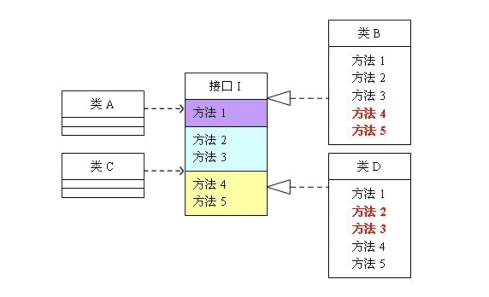
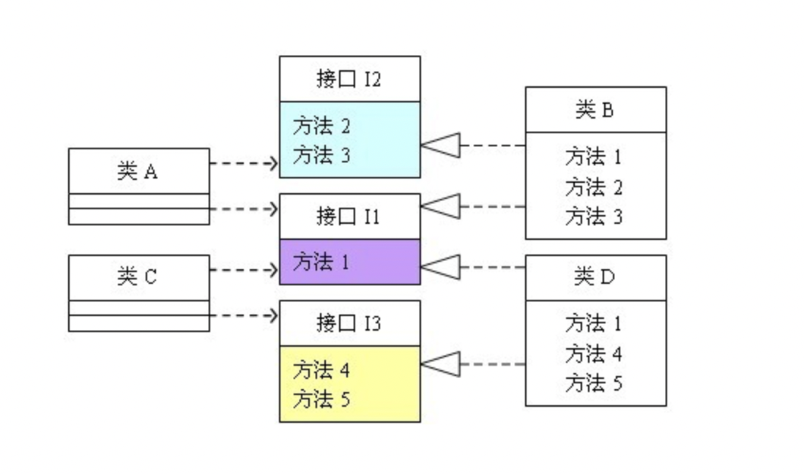

# 设计原则
## OOP三大特征
### 封装

- 封装，就是将客观事物抽象为逻辑实体，实体的属性和功能相结合，形成一个有机的整体。并对实体的属性和功能实现进行访问控制，向信任的实体开放，对不信任的实体隐藏。通过开放的外部接口即可访问，无需知道功能如何实现。

### 继承
- 继承，在继承机制下形成有层级的类，使得低层级的类可以延用高层级类的特征和方法。继承的实现方式有两种：实现继承、接口继承。
  - 实现继承：直接使用基类公开的属性和方法，无需额外编码。
  - 接口继承：仅使用接口公开的属性和方法名称，需要子类实现。
- 目的
  - 复用代码，减少类的冗余代码，减少开发工作量。
  - 使得类与类之间产生关系，为多态的实现打下基础。

### 多态
- 多态，是指一个类的同名方法，在不同情况下的实现细节不同。多态机制实现不同的内部实现结构共用同一个外部接口。也就是说，多态有以下目的：
  - 一个外部接口可被多个同类使用。
  - 不同对象调用同个方法，可有不同实现。
- 多态按字面的意思就是多种形态。当类之间存在层次结构，并且类之间是通过继承关联时，就会用到多态。C++多态意味着调用成员函数时，会根据调用函数的对象的类型来执行不同的函数。
- 虚函数 是在基类中使用关键字 virtual 声明的函数。在派生类中重新定义基类中定义的虚函数时，会告诉编译器不要静态链接到该函数。我们想要的是在程序中任意点可以根据所调用的对象类型来选择调用的函数，这种操作被称为动态链接，或后期绑定。

## 单一职责原则（SRP）
### 概念
- 一个类应该有且只有一个引起他变化的原因，否则类应该被拆分。
- 该原则提出对象不应该承担太多职责，如果一个对象承担了太多地职责，至少存在两个缺点：
  - 一个职责地变化可能会削弱或抑制这个类实现其他职责地能力；
  - 当客户端需要该对象地某一职责时，不得不将其他不需要地职责包含进来，从而造成冗余代码或代码地浪费。

### 优点
- 单一职责原则的核心就是控制类的粒度大小、将对象解耦、提高其内聚性。降低类的复杂度，一个类只负责一项职责，其逻辑肯定要比负责多个职责简单的多；
- 提高类的可读性，
- 提高系统的可维护性，
- 变更引起的风险降低，变更是必然的，如果单一职责原则遵守的好，当修改一个功能时，可以显著降低对其他功能的影响。

### 关键
- 单一职责原则是最简单但又最难运用的原则，需要设计人员发现类的不同职责并将其分离，再将其封装在不同的类或模板中。

## 开闭原则（OCP）
### 概念
- “开-闭”原则讲的是：一个软件实体应当对扩展开放，对修改关闭。这一原则最早由Bertrand Meyer提出，英文原文是：
Software entities should be open for extension,but closed for modification.

- 设计一个模块的时候应该使这个模块可以在不被修改的前提下被扩展。换言之，应该可以在不必修改源代码的情况下改变这个模块的行为。

### 优点
- 所有的软件系统都有一个共同的性质，即对他们的需求会随着时间的推移而发生变化。在软件系统面临新的需求的时候，系统的设计必须是稳定的。满足“开-闭”原则的设计可以给一个软件系统两个无可比拟的优越性：
  - 通过扩展已有的软件系统，可以提供新的行为，以满足对软件的新的需求，使变化中的软件系统有一定的适应性和灵活性。
  - 已有的软件模块，特别是最重要的抽象层模块不能再修改，这就使变化中的软件系统有一定的稳定性和延续性。
- 想象一下，一个久远的系统需要重新修改某个模块的代码，往往是灾难性的，牵一发而动全身，往往很多地方都要跟着改。
  
### 关键
- 解决问题的关键在于抽象化。
  - 规定出所有的具体类必须提供的方法的特征作为系统设计的抽象层。这个抽象层预见了所有的可能扩展，因此，在任何情况下都不会改变。这使得系统的抽象层不需要修改，从而满足了“开-闭”原则的第二条：对修改关闭。
  - 同时，由于从抽象层导出的一个或多个新的具体类可以改变系统的行为，因此系统的设计对扩展是开放的，这就满足了“开-闭”原则的第一条：对扩展开放。
- 对可变性的封装
  - 考虑你的设计中有什么可能会发生变化。这一思想用一句话总结为：“找到一个系统的可变因素，将它封装起来”。
  - 一种可变性不应该散落在代码的很多角落里，而应该被封装到一个对象里面。同一种可变性的不同表象意味着同一个继承等级结构中的具体子类。
  - 一种可变性不应该与另一种可变性混合在一起。

## 里氏替换原则（LSP）
### 概念
- 核心思想是：子类必须能够替换其基类。一个软件实体如果使用的是一个基类的话，那么一定适用于其子类，而且它根本不能察觉出基类对象和子类对象的区别。比如，假设有两个类，一个是Base类，另一个是Child类，并且Child类是Base的子类。那么一个方法如果可以接受一个基类对象b的话:method1(Base b)那么它必然可以接受一个子类的对象method1(Child c).
- 类Base就是对外提供一个接口，具体的实现在类Child中。实现的方法是面向接口编程：将公共部分抽象为基类接口或抽象类，在子类中通过覆写父类的方法实现新的方式支持同样的职责。
- 例子：《墨子:小取》中说，“白马，马也；乘白马，乘马也。骊马，马也；乘骊马，乘马也”。文中的骊马是黑的马。意思就是白马和黑马都是马，乘白马或者乘黑马就是乘马。在面向对象中我们可以这样理解，马是一个父类，白马和黑马都是马的子类，我们说乘马是没有问题的，那么我们把父类换成具体的子类，也就是乘白马和乘黑马也是没有问题的，这就是我们上边说的里氏替换原则。
### 优点
- 里氏替换原则通俗的来讲就是：子类可以扩展父类的功能，但不能改变父类原有的功能。保证了父类的复用性，同时也能够降低系统出错误的故障，防止误操作，同时也不会破坏继承的机制，这样继承才显得更有意义。
- 增强程序的健壮性,版本升级是也可以保持非常好的兼容性.即使增加子类,原有的子类还可以继续运行。在实际项目中,每个子类对应不同的业务含义,使用父类作为参数,传递不同的子类完成不同的业务逻辑。
- 里氏替换原则是继承和多态的综合体现。

### 关键
- 抽象、继承、多态
- 子类可以实现父类的抽象方法，但是不能覆盖父类的非抽象方法。
- 子类中可以增加自己特有的方法。
- 当子类覆盖或实现父类的方法时，方法的前置条件（即方法的形参）要比父类方法的输入参数更宽松。
  - 因为方法的形参严格后，在某种情况就变成重写了。
- 当子类的方法实现父类的抽象方法时，方法的后置条件（即方法的返回值）要比父类更严格。
  - 严格的返回类可以向上安全地转换为不严格的类。

## 依赖倒置原则（DIP）
### 概念
  - 抽象不应当依赖于细节；细节应当依赖于抽象。
  - 针对接口编程而不是针对具体类编程。

### 优点
- 传统的过程性系统的设计方法倾向于使高层次的模块依赖于低层次的模块，抽象层次依赖于具体层次。倒置原则就是要把这个错误的依赖关系倒转过来。
  - 抽象层次包含的是应用程序的商务逻辑和宏观的、对整个系统来说重要的战略性决定，是必然性的体现；
  - 具体层次则含有一些次要的与实现有关的算法和逻辑，以及战术性的决定，带有相当大的偶然性选择。具体层次的代码经常会有变动，不能避免错误。
  - 抽象层次依赖于具体层次，使许多具体层次的细节的算法变化立即影响到抽象层次的宏观的商务逻辑，**倒置微观决定宏观，战术决定战略，偶然决定必然，**，这是错误的。

- 一般情况下抽象的变化概率很小，让用户程序依赖于抽象，实现的细节也依赖于抽象。即使实现细节不断变动，只要抽象不变，客户程序就不需要变化。这大大降低了客户程序与实现细节的耦合度。

### 关键
- 抽象层的设计非常重要

## 接口隔离原则
### 概念
- 客户端不应该依赖它不需要的接口；一个类对另一个类的依赖应该建立在最小的接口上。
- 问题由来：类A通过接口I依赖类B，类C通过接口I依赖类D，如果接口I对于类A和类B来说不是最小接口，则类B和类D必须去实现他们不需要的方法。
- 解决方案：将臃肿的接口I拆分为独立的几个接口，类A和类C分别与他们需要的接口建立依赖关系。也就是采用接口隔离原则。
  
  
### 优点
- 高内聚 低耦合
### 关键
- 接口尽量小，但是要有限度。对接口进行细化可以提高程序设计灵活性是不挣的事实，但是如果过小，则会造成接口数量过多，使设计复杂化。所以一定要适度。
- 为依赖接口的类定制服务，只暴露给调用的类它需要的方法，它不需要的方法则隐藏起来。只有专注地为一个模块提供定制服务，才能建立最小的依赖关系。
- 提高内聚，减少对外交互。使接口用最少的方法去完成最多的事情。

## 组合复用原则（CARP）
### 概念
- 组合复用原则也叫合成/聚合复用原则（CARP），就是在一个新的对象里面使用一些已有的对象，使之成为新对象的一部分；新的对象通过向这些对象的委派达到复用已有功能的目的。
- 这个原则的简短表述就是：要尽量使用组合，尽量不要使用继承。

### 优点
- 在面向对象的设计里，有两种基本的方法可以在不同的环境中复用已有的设计和实现，即通过组合或通过继承。
- 按照组合复用原则我们应该首选组合，然后才是继承，使用继承时应该严格的遵守里氏替换原则，必须满足“Is-A”的关系是才能使用继承，而组合却是一种“Has-A”的关系。导致错误的使用继承而不是使用组合的一个重要原因可能就是错误的把“Has-A”当成了“Is-A”。
- 例子
  - 人被继承到雇员，学生，经理子类。而实际上，雇员、学生和经理分别描述一种角色，而人可以同时有几种不同的角色。所以更抽象更统一的描述应该是雇员，学生，经理等继承角色这个基类，角色这个类被人这个类所有持有（组合）。

### 关键
- 分析类的关系到底是继承还是组合，按照组合复用原则我们应该首选组合，然后才是继承，使用继承时应该严格的遵守里氏替换原则，必须满足“Is-A”的关系是才能使用继承，而组合却是一种“Has-A”的关系。

## 总结
- SOLID原则是维护大型系统所需要遵循的原则，本质是以最小的成本应对“不断变化”的需求，减少维护的复杂性。

<table class="wikitable" style="width: auto; font-size: 95%; table-layout: fixed; line-height:1.25; margin-left: auto; margin-right: auto;">
    <tbody>
        <tr>
            <th>首字母</th>
            <th>指代</th>
            <th>概念
            </th>
        </tr>
        <tr>
            <th>S
            </th>
            <td>
                <a href="/wiki/%E5%8D%95%E4%B8%80%E5%8A%9F%E8%83%BD%E5%8E%9F%E5%88%99" title="单一功能原则">单一功能原则</a>
            </td>
            <td>
                认为“
                <a href="/wiki/%E5%AF%B9%E8%B1%A1_(%E8%AE%A1%E7%AE%97%E6%9C%BA%E7%A7%91%E5%AD%A6)" title="对象 (计算机科学)">对象</a>
                应该仅具有一种单一功能”的概念。
            </td>
        </tr>
        <tr>
            <th>O
            </th>
            <td>
                <a href="/wiki/%E5%BC%80%E9%97%AD%E5%8E%9F%E5%88%99" title="开闭原则">开闭原则</a>
            </td>
            <td>认为“软件应该是对于扩展开放的，但是对于修改封闭的”的概念。
            </td>
        </tr>
        <tr>
            <th>L
            </th>
            <td>
                <a href="/wiki/%E9%87%8C%E6%B0%8F%E6%9B%BF%E6%8D%A2%E5%8E%9F%E5%88%99" title="里氏替换原则">里氏替换原则</a>
            </td>
            <td>
                认为“程序中的对象应该是可以在不改变程序正确性的前提下被它的子类所替换的”的概念。
                

                    参考
                    <a href="/wiki/%E5%A5%91%E7%BA%A6%E5%BC%8F%E8%AE%BE%E8%AE%A1" title="契约式设计">契约式设计</a>
                    。
                

            </td>
        </tr>
        <tr>
            <th>I
            </th>
            <td>
                <a href="/wiki/%E6%8E%A5%E5%8F%A3%E9%9A%94%E7%A6%BB%E5%8E%9F%E5%88%99" title="接口隔离原则">接口隔离原则</a>
            </td>
            <td>
                认为“多个特定客户端接口要好于一个宽泛用途的接口”
                
                    <a href="#cite_note-martin-design-principles-5">&#91;5&#93;</a>
                
                    的概念。
            </td>
        </tr>
        <tr>
            <th>D
            </th>
            <td>
                <a href="/wiki/%E4%BE%9D%E8%B5%96%E5%8F%8D%E8%BD%AC%E5%8E%9F%E5%88%99" title="依赖反转原则">依赖反转原则</a>
            </td>
            <td>
                认为一个方法应该遵从“依赖于抽象而不是一个实例”
                
                    <a href="#cite_note-martin-design-principles-5">&#91;5&#93;</a>
                
                    的概念。
                 
                <a href="/wiki/%E4%BE%9D%E8%B5%96%E6%B3%A8%E5%85%A5" title="依赖注入">依赖注入</a>
                是该原则的一种实现方式。
            </td>
        </tr>
    </tbody>
</table>